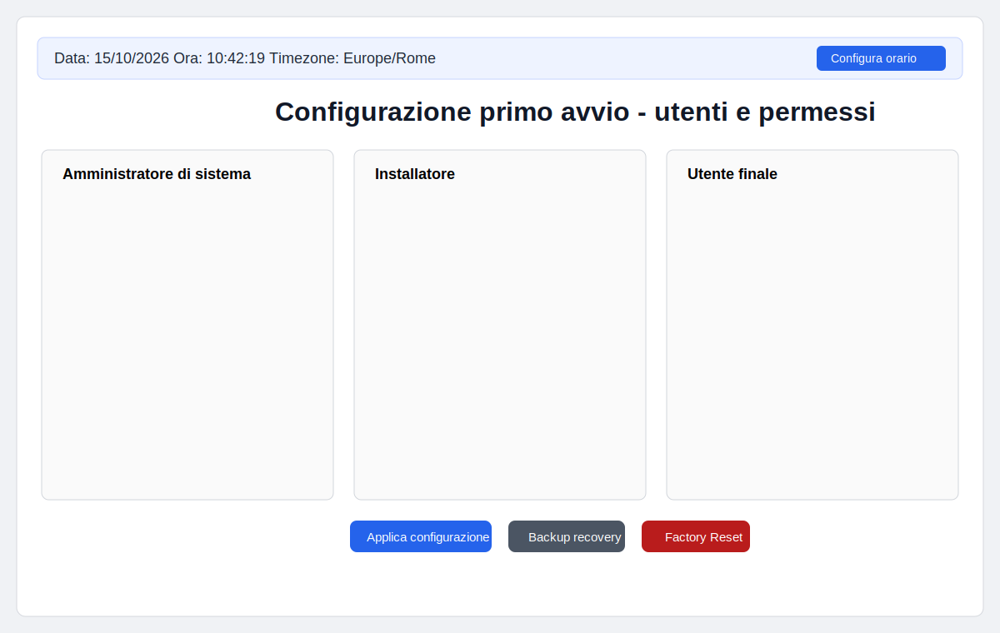

# First Boot System Config

Applicazione web in **Rust** per guidare la configurazione iniziale di un sistema embedded/industrial con gestione utenti, permessi e impostazioni orarie, esposta su `http://<host>:22346`.

## Anteprima GUI



## Cosa fa

- Configura tre profili utente suggeriti (amministratore, installatore, utente finale).
- Permette di assegnare livelli di permesso differenti per ciascun utente.
- Mostra un feedback di complessità password con barra colorata (informativo).
- Esegue azioni lato host (backend Rust) per apply, backup recovery, factory reset e aggiornamento data/ora/timezone.
- Mostra in alto **data, ora e timezone correnti**.
- Include selezione lingua (inglese predefinito, italiano disponibile).
- GUI responsive con target minimo 1024x600.

## Istruzioni di compilazione

Prerequisiti minimi:

- `rustc` / `cargo` (toolchain Rust recente)

Build e run:

```bash
cargo build --release
cargo run
```

Aprire poi il browser su:

```text
http://localhost:22346
```

## Setup sintetico ambiente Rust su Linux (Debian/Ubuntu)

### 1) Installare dipendenze di base

```bash
sudo apt update
sudo apt install -y build-essential curl
```

### 2) Installare Rust (rustup)

```bash
curl --proto '=https' --tlsv1.2 -sSf https://sh.rustup.rs | sh
source "$HOME/.cargo/env"
rustup update stable
```

### 3) Verifica toolchain

```bash
rustc --version
cargo --version
```
